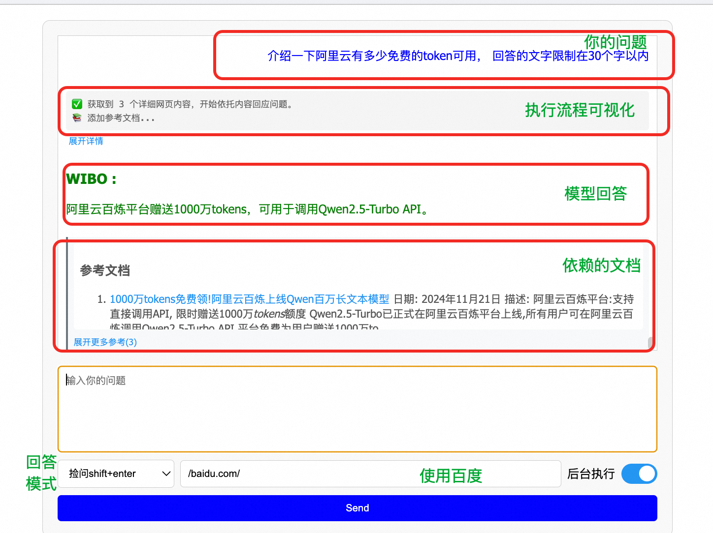

# 围脖(WIBO) - 你的个人知识助手

## 简介
围脖是一个完全开放的客户端检索增强工具，帮助你更快、更准确地获取所需信息。

## 主要功能
1. **本地检索问答**：基于本地文件（如Word、PDF、PPT、代码等）回答问题。
2. **网站检索问答**：通过内置浏览器从特定网站（如百度、Bing、知乎）检索信息并汇总回答。

## 产品特色
- **深度检索问答**：支持多文档，大文档的检索问答，没有传统模式下的上下文限制，回答比使用市面上其他产品更为精准，几乎不会漏掉关键信息
- **强大的文档解析能力**：支持解析多种格式的本地文档及图片中的文字（需消耗tokens），提高回答准确性。
- **原始链接提供**：每次回答附带原始链接，便于验证信息的真实性。
- **数据完全本地安全**：除了发给大模型的请求外，所有请求全部在本地完成

# 使用说明

## 前置条件
需要您在本地安装过google chrome的比较新的版本。 如果不够新的话，可能需要升级。

## 下载与安装

1. **下载最新版本**：
   - **GitHub**: [点击这里](https://github.com/wibo-client/wibo/releases)
   - **百度网盘**: [链接](https://pan.baidu.com/s/1YZILuhbZbK5dWAQ2v5-R_A?pwd=wibo) 提取码: `wibo`

## 配置与使用

2. **配置阿里云 AK**：在系统配置界面中填写阿里云的访问密钥（AK）。

阿里云的通义千问有100w的免费额度，搞定账号就行。  非免费额度一万字差不多2分钱，也很便宜。
[点我查看具体怎么获取阿里云访问AK](./docs/getAliyunAK.md)

3. **本地内容检索**（可选）：
   - 打开本地知识库开关。
   - 选择一个目录，提交并等待索引完成率显示为100%。
   - 在快捷导航中选择“本地文件检索”或使用`/local/`命令快速启动。

4. **网站检索**：
   - 直接在对话框中输入问题，按`Shift + Enter`即可获取答案。
   - 或者/baidu.com/ 然后输入问题，再按`Shift + Enter` 。

5. **深度检索**：
   - 准备好本地内容 ，放在一个子目录里
   - 确认子目录是挂在wibo上的
   - 在path里面输入 你目录的关键词 选中那个目录 ，然后在后面加 * , 类似/local/yourdict/*
   - 输入问题 然后按`Alt + Enter` 。

## License

本软件是双协议版本软件。 
软件本体遵循GPLV3协议，也即如果你自己用这个产品，那么完全免费开源，随意使用。
但如果你要对本产品做商业分发（也即依托本产品的代码做的软件二次开发然后打包允许别人下载或付费），则您的软件源码也必须开源。 

开源 也即 我为人人 人人为我 。 请您遵循该协议 。 

This project is dual-licensed under the following licenses:

1. **GNU General Public License v3.0 (GPLv3)**: See the [LICENSE](./LICENSE) file for details.
2. **Commercial License**: For commercial use, please see the [COMMERCIAL_LICENSE](./COMMERCIAL_LICENSE.md) file for details.
